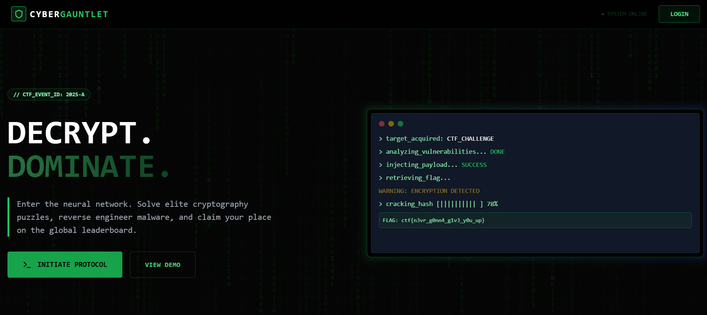
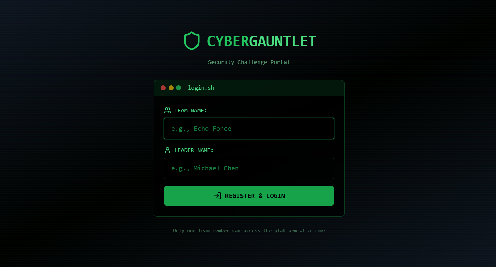
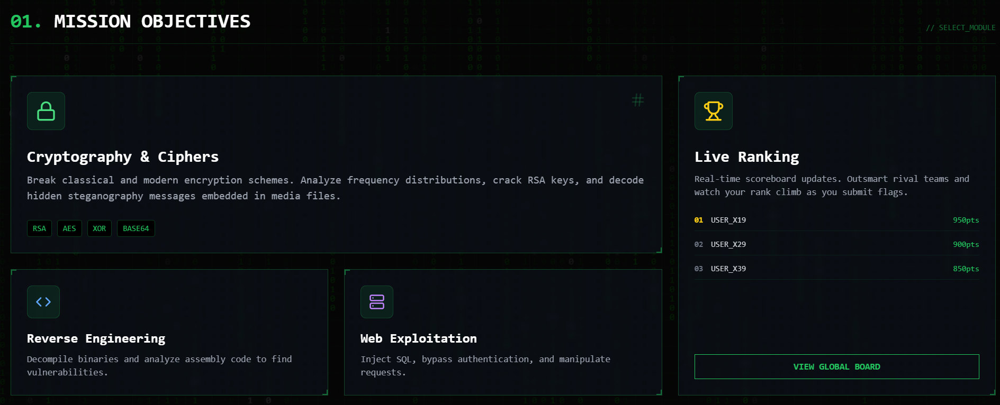

# CyberGauntlet

CyberGauntlet is a lightweight CTF-style platform focused on cipher challenges. Players download encrypted assets, apply provided hints to recover plaintext, and submit flags or answers. This repository contains a React + TypeScript frontend and a simple challenge layout served from `public/challenges`.

## 🎨 UI Preview

A quick visual overview of the platform:

### 🏁 Landing Page


### 🔐 Login / Registration


### 🎯 Mission Objectives


---
## Features

- Static challenge delivery via `public/`
- Frontend: Vite + React + TypeScript
- Optional Supabase integration for auth/leaderboards (`src/lib/supabase.ts`)

## Quick start

Install dependencies and start the development server:

```powershell
npm install
npm run dev
```

## Docker (Optional)

This repository supports an optional Docker-based local development workflow.
It is intended to reduce setup friction and keep environments consistent across OSes.

Start the dev stack:
```powershell
docker compose up --build
```

For a deeper walkthrough, see `docker_guide.md`.

Build and preview a production bundle:

```powershell
npm run build
npm run preview
```

## Challenge layout

Challenges are organized under `public/challenges`. Each challenge should reside in its own folder (for example `q1`, `q2`, ...). Recommended contents:

- `hint.txt` — concise hints or instructions
- `assets/` — encrypted files, ciphertext dumps, images, etc.
- `README.md` — (optional) description and expected flag format (for example `FLAG{...}`)

Example:

```
public/challenges/q1/
├─ cipher_collection.txt
└─ hint.txt
```

## Solver workflow

1. Open the challenge page and download the provided assets.
2. Use the hints to determine the cipher or encoding.
3. Decrypt or decode assets locally to recover the flag.
4. Submit the flag following the challenge rules.

Files in `public/` are served statically by the dev server and are available for download in the browser.

## Encryption / decryption examples

Use standard command-line tooling. Example (OpenSSL, AES-256-CBC):

```powershell
# Encrypt
openssl enc -aes-256-cbc -salt -in secretnote.txt -out secretnote.txt.enc -k "yourpassword"

# Decrypt
openssl enc -d -aes-256-cbc -in secretnote.txt.enc -out secretnote.txt -k "yourpassword"
```

Simple Python example (Caesar cipher, shift = 3):

```python
from pathlib import Path

text = Path('cipher_collection.txt').read_text()

def caesar(s: str, shift: int = 3) -> str:
    out = []
    for c in s:
        if c.isupper():
            out.append(chr((ord(c) - ord('A') - shift) % 26 + ord('A')))
        elif c.islower():
            out.append(chr((ord(c) - ord('a') - shift) % 26 + ord('a')))
        else:
            out.append(c)
    return ''.join(out)

print(caesar(text))
```

## Authoring new challenges

To add a challenge:

1. Create `public/challenges/qX/` (replace `qX` with a new identifier).
2. Add assets and a `hint.txt` or `README.md` describing the objective and flag format.
3. Verify assets are downloadable from the dev server.

## Security and best practices

- Do not commit secrets (API keys, credentials) to the repository.
- For hosted competitions, perform server-side submission validation and rate limiting.

## Developer notes & next steps

- Tech stack: Vite + React + TypeScript (see `package.json` for scripts).
- Recommended improvements:
  - Challenge authoring CLI to standardize asset creation.
  - Server-side submission validation and scoreboard.
  - Unit tests and CI workflow for lint/typecheck.

## Contact

If you would like assistance adding challenges, integrating a scoreboard, or automating challenge creation, please open an issue or request changes in the repository.

## Contribution

Contributions are welcome and appreciated.

Before contributing, please read the following documents to understand our guidelines and expectations:
- [Code of Conduct](Docs/CODE_OF_CONDUCT.md)
- [Contribution Guidelines](Docs/Contributor.md)

To contribute:
1. Fork the repository
2. Create a new branch for your changes `git checkout <feature-branch>`
3. Make your changes following the project standards `git add <FILE>`
4. Commit and push your changes to your fork 
`git commit -m "<commit-message>"`
`git push origin <feature-branch>`
5. Open a Pull Request for review

By participating in this project, you agree to follow the Code of Conduct.

## License
This project is licensed under the MIT License. See the [LICENSE](LICENSE) file for details.

## 📁 Folder Architecture
```bash
📁 CyberGauntlet/
├───📁 Databases/
│   └───📁 supabase/
│       └───📁 migrations/
|           ├───📄 <date>_create_leaderboard.sql
|           ├───📄 <date>_create_public_schema.sql
|           ├───📄 <date>_posts_rls_policies.sql
|           └───📄 <date>_create_team_sessions.sql
├───📁 Docs/
│   └───📁 screenshots/
|        ├───📄 Landing.png
|        ├───📄 Login.png
|        └───📄 Objective.png
|   ├───📄 ADMIN_SETUP.md
|   ├───📄 CODE_OF_CONDUCT.md
|   ├───📄 Contributing.md
|   ├───📄 LEADERBOARD.md
|   └───📄 LEADERBOARD_IMPLEMENTATION.md
├───📁 Json/
|   ├───📄 index.html
|   ├───📄 tsconfig.json
|   └───📄 ... (4 more .json files)
├───📁 public/
│   └───📁 challenges/
│       ├───📁 q1/
|       |   ├───📄 cipher_collection.txt
|       |   └───📄 hint.txt
│       ├───📁 q3/
|       |   └───📄 security.c
│       ├───📁 q4/
|           └───📄 secretnote.txt
└───📁 src/
    ├───📁 components/
    |   ├───📄 ChallangePage.tsx
    |   ├───📄 DocsPage.tsx
    |   ├───📄 GlitchPage.tsx
    |   ├───📄 Landingpage.tsx
    |   ├───📄 Leaderboard.tsx
    |   └───📄 Terminalbox.tsx
    ├───📁 context/
    |   └───📄 AuthContent.tsx
    ├───📁 data/
    |   └───📄 teamData.ts
    ├───📁 lib/
    |   └───📄 supabase.ts
    └───📁 pages/
    |   ├───📄 Dashboard.tsx
    |   ├───📄 LeaderBoardPage.tsx
    |   ├───📄 Login.tsx
    |   └───📄 ProtectedRoute.tsx
    ├───📄 App.tsx
    ├───📄 index.css
    ├───📄 main.tsx
    └───📄 vite-env.d.ts
├───📄 index.html
├───📄 (... 17 more files)
    
```
---

## 📁 Project Structure

```text
📁 docs/            → README.md, ADMIN_SETUP.md, Contributor.md,LEADERBOARD_IMPLEMENTATION.md,CODE_OF_CONDUCT.md,
📁 screenshots
📁 src/             → Application source code  
📁 public/          → Public assets and challenges  
📁 database/        → Supabase migrations  
📁 config/          → ESLint, Vite, Tailwind, PostCSS, TSConfig files  
```

Feel free to use and modify the code as needed for your own CTF events!
